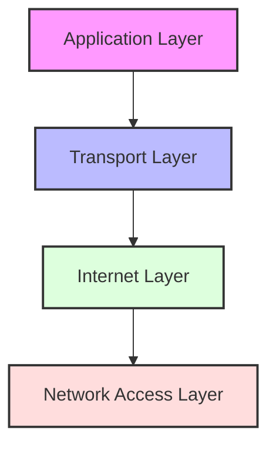
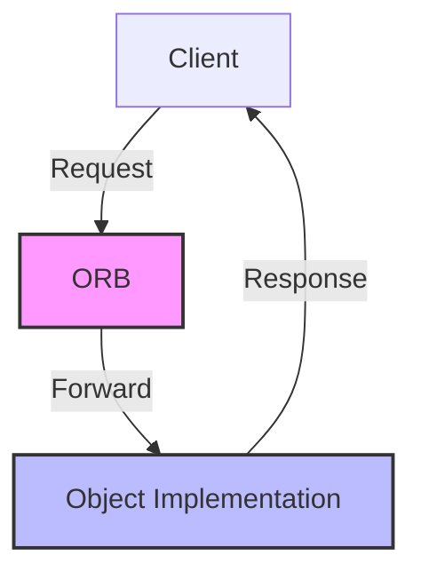
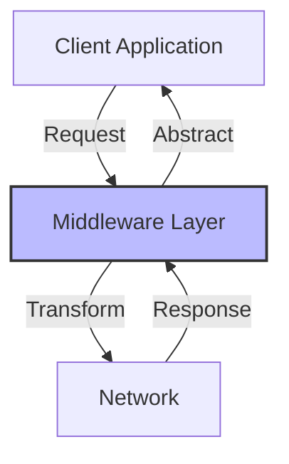
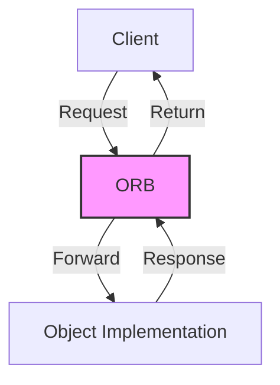

# Distributed Computing
Understanding Socket-Based and Middleware-Based Approaches

<div class="pt-12">
  <span @click="$slidev.nav.next" class="px-2 py-1 rounded cursor-pointer" hover="bg-white bg-opacity-10">
    Next Slide <carbon:arrow-right class="inline"/>
  </span>
</div>

---
layout: default
---

# Table of Contents

1. Client/Server Based Distributed Programming
   - TCP/IP Layers and Protocols
   - Transport Layer Protocol
   - TCP vs UDP
   - Java Socket Programming Components
   - TCP Socket Programming Example
   - UDP Socket Programming Example
2. Middleware Based Distributed Programming
   - Overview of Middleware
   - Remote Method Invocation
   - Common Object Request Broker Architecture

---
layout: two-cols
---

# TCP/IP Layers and Protocols

The TCP/IP protocol stack consists of four layers:

1. Application Layer
   - HTTP, FTP, SMTP
   - Application-specific protocols

2. Transport Layer
   - TCP, UDP
   - End-to-end communication

3. Internet Layer
   - IP addressing
   - Routing
   - Packet forwarding

::right::

4. Network Access Layer
   - Physical transmission
   - Hardware interfaces



---
layout: two-cols
---

# Transport Layer Protocol

Key characteristics:

1. TCP (Transmission Control Protocol)
   - Connection-oriented
   - Reliable delivery
   - Flow control
   - Error checking
   - Ordered delivery

2. UDP (User Datagram Protocol)
   - Connectionless
   - No guarantee of delivery
   - No flow control
   - Faster transmission
   - Suitable for real-time applications

::right::



---
layout: two-cols
---

# TCP vs UDP

## TCP
- Establishes connection before data transfer
- Guarantees data delivery
- Maintains packet order
- Includes error checking
- Higher overhead
- Used for: Web browsing, email, file transfer

::right::

## UDP
- No connection establishment
- No delivery guarantee
- No packet ordering
- Minimal error checking
- Lower overhead
- Used for: Streaming, gaming, VoIP

---
layout: default
---

# Java Socket Programming

Core Components:

```java
// Socket Classes
Socket socket;              // TCP client socket
ServerSocket serverSocket;  // TCP server socket
DatagramSocket udpSocket;   // UDP socket
DatagramPacket packet;      // UDP packet

// Network Address Classes
InetAddress address;        // IP address representation
SocketAddress endpoint;     // Socket endpoint
```

---
layout: default
---

# TCP Socket Programming - Server Side

<div class="grid grid-cols-2 gap-2">
<div>

```java {all|1-2|4-5|7-8|10-14|16-21|all}
public class TCPServer {
    private static final int PORT = 8080;
    public static void main(String[] args) {
        try (ServerSocket serverSocket = 
                new ServerSocket(PORT)) {
            System.out.println("Server listening on port " 
                + PORT);
            while (true) {
                // Accept client connection
                Socket clientSocket = serverSocket.accept();
                System.out.println("Client connected: " + 
                    clientSocket.getInetAddress());
                // Handle client in new thread
                new Thread(() -> 
                    handleClient(clientSocket)).start();
            }
        } catch (IOException e) {
            System.err.println("Server error: " 
                + e.getMessage());
            e.printStackTrace();
        }
    }
```

</div>
<div>

```java {all}
    private static void handleClient(Socket clientSocket) {
        try (
            BufferedReader in = new BufferedReader(
                new InputStreamReader(
                    clientSocket.getInputStream()));
            PrintWriter out = new PrintWriter(
                clientSocket.getOutputStream(), true)
        ) {
            String message;
            while ((message = in.readLine()) != null) {
                System.out.println("Received: " + message);
                out.println("Server received: " + message);
            }
        } catch (IOException e) {
            System.err.println("Client handler error: " 
                + e.getMessage());
        }
    }
}
```

</div>
</div>

---
layout: default
---

# TCP Socket Programming - Client Side

<div class="grid grid-cols-2 gap-2">
<div>

```java {all|1-2|4-9|11-16}
public class TCPClient {
    private static final String SERVER_ADDRESS = "localhost";
    private static final int SERVER_PORT = 8080;
    public static void main(String[] args) {
        try (
            Socket socket = new Socket(
                SERVER_ADDRESS, SERVER_PORT);
            BufferedReader in = new BufferedReader(
                new InputStreamReader(
                    socket.getInputStream()));
            PrintWriter out = new PrintWriter(
                socket.getOutputStream(), true);
            BufferedReader userInput = new BufferedReader(
                new InputStreamReader(System.in))
        ) {
```

</div>
<div>

```java {all}
            System.out.println("Connected to server. Type messages:");

            String userMessage;
            while ((userMessage = userInput.readLine()) != null) {
                // Send message to server
                out.println(userMessage);
                
                // Receive server's response
                String response = in.readLine();
                System.out.println("Server response: " + response);
                
                if (userMessage.equalsIgnoreCase("exit")) {
                    break;
                }
            }
        } catch (IOException e) {
            System.err.println("Client error: " + e.getMessage());
            e.printStackTrace();
        }
    }
}
```

</div>
</div>

---
layout: default
---

# UDP Socket Programming - Server Side

<div class="grid grid-cols-2 gap-2">
<div>

```java {all|1-2|4-8|10-17}
public class UDPServer {
    private static final int PORT = 9090;

    public static void main(String[] args) {
        try (DatagramSocket socket = 
                new DatagramSocket(PORT)) {
            System.out.println("UDP Server listening on port " 
                + PORT);
            byte[] receiveBuffer = new byte[1024];
            while (true) {
                // Prepare packet for receiving data
                DatagramPacket receivePacket = 
                    new DatagramPacket(
                        receiveBuffer, 
                        receiveBuffer.length);
```

</div>
<div>

```java {all}
                // Receive packet from client
                socket.receive(receivePacket);
                // Process received data
                String message = new String(
                    receivePacket.getData(), 0, 
                    receivePacket.getLength()
                );
                System.out.println("Received: " + message);
                
                // Prepare and send response
                String response = "Server received: " + message;
                byte[] sendBuffer = response.getBytes();
                DatagramPacket sendPacket = new DatagramPacket(
                    sendBuffer, sendBuffer.length,
                    receivePacket.getAddress(),
                    receivePacket.getPort()
                );
                socket.send(sendPacket);
            }
        } catch (IOException e) {
            System.err.println("Server error: " + e.getMessage());
            e.printStackTrace();
        }
    }
}
```

</div>
</div>

---
layout: default
---

# UDP Socket Programming - Client Side

<div class="grid grid-cols-2 gap-2">
<div class="text-sm">

```java {all|1-3|5-12|14-21}
public class UDPClient {
    private static final String SERVER_ADDRESS = "localhost";
    private static final int SERVER_PORT = 9090;

    public static void main(String[] args) {
        try (
            DatagramSocket socket = new DatagramSocket();
            BufferedReader userInput = new BufferedReader(
                new InputStreamReader(System.in))
        ) {
            InetAddress serverAddress = 
                InetAddress.getByName(SERVER_ADDRESS);
            
            System.out.println("Type messages to send:");
            
            String message;
            while ((message = userInput.readLine()) != null) {
                // Send data to server
                byte[] sendBuffer = message.getBytes();
                DatagramPacket sendPacket = 
                    new DatagramPacket(
                        sendBuffer, sendBuffer.length,
                        serverAddress, SERVER_PORT
                    );
```

</div>
<div class="text-sm">

```java {all}
                socket.send(sendPacket);
                // Receive server's response
                byte[] receiveBuffer = new byte[1024];
                DatagramPacket receivePacket = 
                    new DatagramPacket(receiveBuffer, receiveBuffer.length);
                socket.receive(receivePacket);
                // Process response
                String response = new String(
                    receivePacket.getData(), 0, 
                    receivePacket.getLength()
                );
                System.out.println("Server response: " 
                    + response);
                if (message.equalsIgnoreCase("exit")) {
                    break;
                }
            }
        } catch (IOException e) {
            System.err.println("Client error: " 
                + e.getMessage());
            e.printStackTrace();
        }
    }
}
```

</div>
</div>

---
layout: two-cols
---

# Middleware Based Programming

## Overview
- Abstracts network complexity
- Provides high-level APIs
- Manages distributed resources
- Handles heterogeneity

## Types
1. RPC Middleware
2. Message-Oriented Middleware
3. Object-Oriented Middleware

::right::



---
layout: default
---

# Remote Method Invocation (RMI)

```java {all|1-3|5-8|10-13}
// Define Remote Interface
public interface Calculator extends Remote {
    int add(int a, int b) throws RemoteException;
}

// Implement Remote Interface
public class CalculatorImpl extends UnicastRemoteObject 
    implements Calculator {
    public int add(int a, int b) { return a + b; }
}

// Client Usage
Calculator calc = (Calculator) Naming.lookup(
    "rmi://localhost/Calculator"
);
```

---
layout: two-cols
---

# CORBA Architecture

## Components
1. Object Request Broker (ORB)
2. Interface Definition Language (IDL)
3. Static & Dynamic Interfaces
4. Object Services

## Features
- Language independence
- Platform independence
- Location transparency
- Protocol standardization

::right::



---
layout: center
class: text-center
---

# Thank You!

[Learn More About Distributed Computing](https://how.dev/answers/what-is-middleware-in-distributed-systems)
